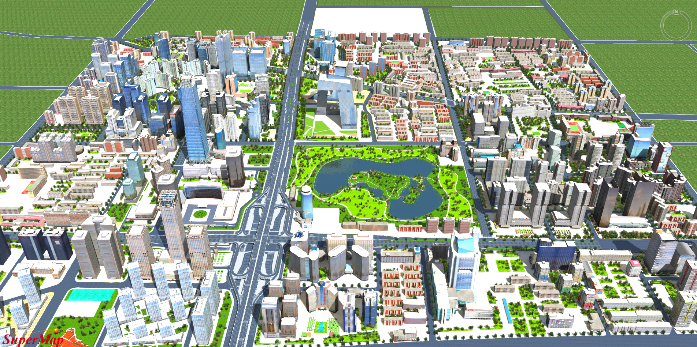
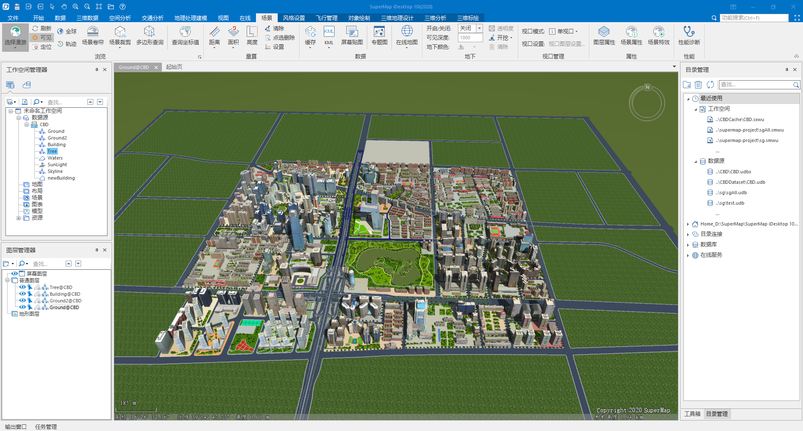

# iServer-lite
[国外仓库](https://github.com/iServer-lite/iServer-lite)|
[国内仓库](https://gitee.com/iServer-lite/iServer-lite)



`iServer-lite`是一个基于`SuperMap_iClient3D_10i(2020)`和`SuperMap iServer 10i(2020)`定制开发的小程序，用于发布高性能海量`s3mb`地图数据，相比于超图原生`iServer`具有如下特点：

- 无需试用，无需付费，直接使用（`仅供测试学习之用`）
- 服务启动速度快（`毫秒级`）
- 跨平台运行，无需任何前置环境要求（`Windows双击程序即可运行，Linux命令行直接运行`）
- 程序体积小（目前不超过`30MB`）
- 加载效率更高（基于`Go`开发）
- 支持海量`s3mb`数据加载，可以完全替代原生`iServer`发布的`s3mb`地图服务

本程序目前实现了`s3mb`地图数据格式的加载，不包含任何`GIS分析`和`属性查询（拾取）`逻辑，适用于对GIS分析功能要求不高并需要高性能展示三维地图的场景，对于仅需要高性能展示海量数据的场景，可以完全替代超图原生`iServer`，方便前端同学日常学习超图`JSAPI`，并了解数据从生产到上图的整个过程。

> 属性查询（拾取）功能正在开发完善中。。。

本程序需要超图`iDesktop`软件提供原始数据制作，官方软件下载地址：

- [下载首页](http://support.supermap.com.cn/DownloadCenter/ProductPlatform.aspx)
- [iDesktop 10i下载](http://support.supermap.com.cn/DownloadCenter/DownloadPage.aspx?id=1275)

如需完整的`iServer`功能，请自行下载超图官方`iServer`软件

- [SuperMap iServer 10i(2020) SP3 for Windows(x64)(Deploy包）](http://support.supermap.com.cn/DownloadCenter/DownloadPage.aspx?id=1667)

# 使用方法

先拉取代码，运行demo

```bash
git clone https://github.com/iServer-lite/iServer-lite.git
```

目录结构如下

```
iServer-lite
 ├── image
 ├── index.html						# 示例HTML文件
 ├── iServer-lite					# Linux二进制可执行程序
 ├── iServer-lite.exe				# Windows可执行程序
 ├── README.md
 ├── s3mb							# s3mb缓存文件夹
 │   └── CBDCache						# 项目文件夹
 │       ├── Building@CBD					# 项目中子图层（建筑物）
 │       ├── Ground2@CBD					# 项目中子图层（地表2）
 │       ├── Ground@CBD						# 项目中子图层（地表1）
 │       ├── Tree@CBD						# 项目中子图层（树木）
 │       └── Waters@CBD						# 项目中子图层（水系）
 ├── supermap-lib					# 超图官方JSAPI
 │   ├── Cesium
 │   │   ├── Assets
 │   │   ├── Cesium.js
 │   │   ├── ThirdParty
 │   │   ├── Widgets
 │   │   └── Workers
 └── udbx							# udbx数据集（用于未来属性查询（拾取））
     └── CBD							# 项目文件夹
         └── CBD.udbx						# 项目中数据源（里面有多个数据集）
```

如果是`Windows`系统，直接双击运行`iServer-lite.exe`文件，开启服务

> 第一次运行系统会弹出网络访问许可信息框，点击`允许`

如果是`Linux`系统，可以把`iServer-lite`写入到系统服务，直接使用`systemctl start iServer-lite`指令开启服务

`iServer-lite`服务开启后，需要使用类似`vscode`的`Live Server`插件功能的代理服务，用现代浏览器打开`index.html`，`Edge`访问效果如下：


数据使用的是超图官方`CBD`示例数据，`JSAPI`使用的是超图官方的`iClient3D`，前端开发流程跟超图官方一致，代码逻辑完全一样，只需事先把`s3mb`文件夹项目层次关系整理好即可，目前只支持`Scene`的`addS3MTilesLayerByScp`方法加载指定图层数据
> 由于数据大小限制，故没有提交官方`CBD.udbx`文件，目前只是用了一个空文件占位

```
http://127.0.0.1:666/rest/realspace/datas/{项目文件夹}/{项目数据源的子图层}/{项目数据源的子图层}/config
http://127.0.0.1:666/rest/realspace/datas/CBDCache/Building@CBD/Building@CBD/config
```

> `s3mb`文件夹目录层次非常重要，请仔细核对结构，目前不支持修改目录层次

加载核心代码如下

```javascript

let viewer = new Cesium.Viewer("cesiumContainer");
let promise = [];
let tileArr = [
    "Building@CBD",
    "Ground@CBD",
    "Ground2@CBD",
    "Tree@CBD",
    "Waters@CBD",
];
for (let index = 0; index < tileArr.length; index++) {
    promise.push(
        viewer.scene.addS3MTilesLayerByScp(
            `http://127.0.0.1:666/rest/realspace/datas/CBDCache/${tileArr[index]}/${tileArr[index]}/config`,
            {
                name: tileArr[index],
            }
        )
    );
}
Promise.all(promise).then((layers) => {
    viewer.flyTo(layers[2]);
});
```

以上就是使用`iServer-lite`程序的完整流程了

# 数据制作

用超图官方`iDesktop`软件完成倾斜影像、人工建模等数据入库，一般情况下，`iDesktop`默认使用的数据源是`udb`文件，这个不影响`s3mb`缓存文件的生成，不过为了未来可以直接使用`属性查询（拾取）`功能，建议先把`udb`文件转换成`udbx`文件，然后在用`udbx`文件去生成`s3mb`缓存文件，这样即可以方便移植和备份元数据，又方便可以使用`iServer-lite`进行属性查询和拾取。



